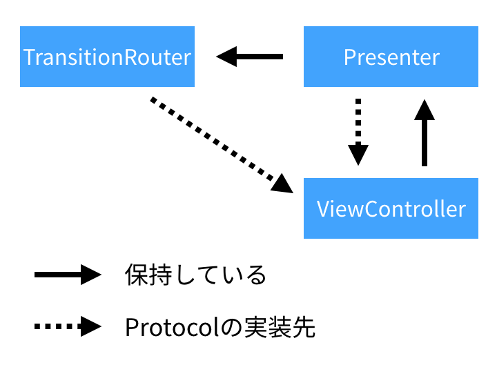

# TransitionRouterSample
An implementation sample of TransitionRouter which manages ViewController transition.

## これはなに？
MVPにおけるView(Controller)とPresenterに(Transition)Routerという概念を追加し、以下のことを実現する実装サンプルです。

- ViewControllerが別のViewControllerを知らなくてよいようにする（関心の分離）
- 画面ごとの遷移先の一元管理
- Protocolを実装することによって依存をなくす

こちらにもまとめを書きましたので、合わせて読んでみてください。

[\[iOS\] ViewControllerが遷移先のViewControllerについて知っているのが気持ち悪い！ ｜ Developers\.IO](http://dev.classmethod.jp/smartphone/iphone/ios-viewcontroller-knows-viewcontroller-feel-strange/)



## ちょっとした解説

### 実装の解説

- 遷移のハンドルは表示系ロジックを管理するPresenterが行っている
- ViewControllerはTransitionRouterDelegate（Protocol）から渡されたViewControllerへの遷移を実行するのみ
  - 渡すViewController、遷移方法に関する情報は渡された側のViewControllerは知らない
  - 渡された側のViewControllerが遷移先のViewController、遷移方法について設定することはない

### 解決したいこと

ここでアンチパターンとして捉えているのは以下のような実装のこと。

```swift
import UIKit

class AViewController: UIViewController {
    
    ......
    ...
    
    func transition() {
        // ⬇︎AViewControllerがBViewControllerについて知っていたり、遷移を管理していたりする
        guard let bViewController = UIStoryboard(name: "Main", bundle: nil).instantiateViewController(withIdentifier: "BViewController") as? BViewController else { return }
        present(bViewController, animated: true, completion: nil)
    }
    
    ......
    ...
    
}

```

## 今後の研究事項
- TransitionRouterは各VCごとに存在するべきか？それともSingletonで実装されたsharedInstanceであるべきか？
- TransitionRouterはさらに共通化・抽象化ができないか？
